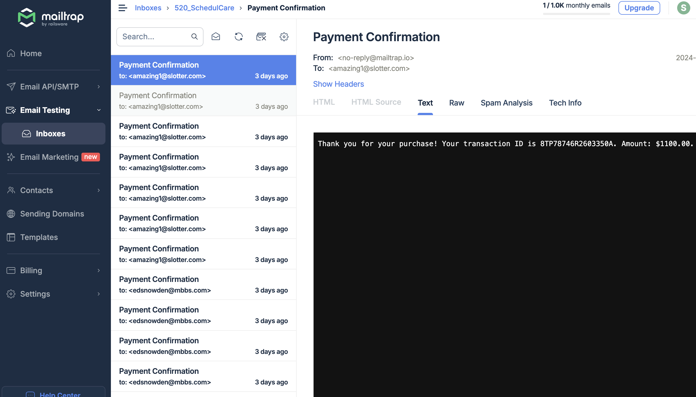

# 520-SchedulCare

## Client setup

Pre-Requisites :
Node (22.9.0 or higher) and npm

1. Navigate to `client\` dir

2. Install all the client libraries using the command 
   ```bash
   npm install
   ```

3. To start the client application, run
   ```bash
   npm start
   ```
   The application runs on localhost:3000


## Server setup

1. Install fastapi. Run from `server` dir
   ```bash
   pip install -r requirements.txt
   ```
2. Navigate to `server/app` dir and set your python path
   ```bash
   export PYTHONPATH=$PWD
   ```
3. Run the server
   ```bash
   fastapi dev main.py
   ```

## Adding endpoints [devs only section]

1. Create a file for your module if does not exist
2. Add your routes in the file. Refer to [patient_router.py](server/app/routers/patient_router.py)
   - Use `APIRouter` to create child routes
3. Add your router in [main.py](server/app/main.py) with the prefix

## Connecting with Mongo

1. Once done creating a Mongo account and getting added to the database. Create a `.env.dev` file in the server directory.
2. Create a variable in the said file `MONGO_URI=<your_mongo_url>`
   - When getting the Mongo URL, select the language to be Python.
   - **DO NOT COMMIT** this file. (thanks!)

## Using cypress testing

1. Once done creating an end-to-end test in client/cypress/e2e, view the test work using `npx cypress open`. Make sure the application is already running.

## Paypal Payment Gateway Setup (Sandbox version)

### Get client ID and client secret

PayPal integrations use a client ID and client secret to authenticate API calls:

1. A client ID identifies an app. You only need a client ID to get a PayPal payment button and standard credit and debit card fields.
2. A client secret authenticates a client ID. To call PayPal APIs, you'll exchange your client ID and client secret for an access token. Keep this secret safe.

Exchange your client ID and client secret for an access token. The access token authenticates your app when calling PayPal REST APIs. You can call the PayPal OAuth API in any language.

Here's how to get your client ID and client secret:

1. Select [Log in to Dashboard](https://developer.paypal.com/dashboard/) and log in or sign up.
2. Select Apps & Credentials.
3. New accounts come with a Default Application in the REST API apps section. To create a new project, select Create App.
4. Copy the client ID and client secret for your app.

Add the Client ID and Client Secret in .env file with keys `PAYPAL_CLIENT_ID` and `PAYPAL_CLIENT_SECRET`

### Get sandbox account credentials

The PayPal sandbox is a test environment that mirrors real-world transactions. By default, PayPal developer accounts have 2 sandbox accounts: a personal account for buying and a business account for selling. You'll get the login information for both accounts. Watch sandbox money move between accounts to test API calls.

Take the following steps to get sandbox login information for business and personal accounts:

1. Log into the Developer Dashboard.
2. Select Testing Tools > Sandbox Accounts. You can create more sandbox accounts by selecting Create account.
3. Locate the account you want to get credentials for and select ⋮
4. Select View/Edit Account to see mock information such as the account email and system-generated password.
5. Go to sandbox.paypal.com/signin and sign in with the personal sandbox credentials. In a separate browser, sign in with the business sandbox credentials.
6. Make API calls with your app's access token to see sandbox money move between personal and business accounts.

### Testing Payment Flow SchedulCare

1. Patient schedules appointment with doctor.
2. This action is redirects to Payment Page
3. Checkout using Paypal option to test using sandbox credentials.
4. Use the test Sandbox account credentials. Remember to use personal sandbox credentials for this flow. Business sandbox credentials are for merchants.
5. Once logged in, authorise the payment.

## Email Notification Setup (mailtrap.io SMTP Service)

1. Ensure you have FastAPI-Mail installed. Install them using:
   ```bash
   pip install fastapi-mail
   ```
2. Mailtrap Account: Sign up for a free account at [Mailtrap](https://mailtrap.io/) to obtain SMTP credentials.

### Configure Mailtrap SMTP Settings

1. Log in to your Mailtrap account.

2. Navigate to Inboxes → Select your inbox.

3. Find SMTP credentials:

   1. Host: sandbox.smtp.mailtrap.io
   2. Port: 587
   3. Username: <Your Mailtrap Username>
   4. Password: <Your Mailtrap Password>

4. Add the Username and Password in .env file with keys `MAIL_USERNAME` and `MAIL_PASSWORD`

### How to View Received Emails in Mailtrap

1. Log in to [Mailtrap.io](https://mailtrap.io/)
2. After logging in, you’ll land on the Dashboard.
3. Under the Inboxes section, you’ll see a list of your inboxes.
4. Select the inbox where you’ve configured your SMTP credentials (usually the default "My Inbox").
5. Once inside the selected inbox, you’ll see a list of received emails.
6. Click on any email to open and view its content.


